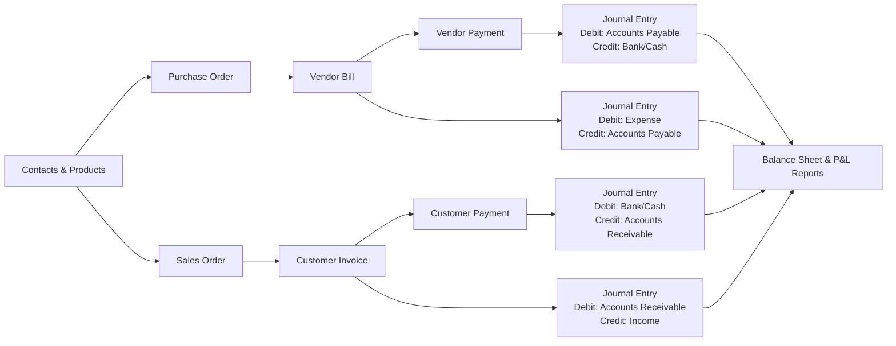

<div align="center">

# 🪑 Urban Furniture Accounting System

**A full-stack, double-entry accounting system built for furniture businesses.**

Master data management · Purchase & Sales workflows · Automated journal entries · Balance Sheet & P&L reports · Budget tracking · Role-based access control

[](https://fastapi.tiangolo.com/)
[](https://nextjs.org/)
[](https://neon.tech/)
[](https://tailwindcss.com/)

</div>

---

## 📋 Table of Contents

- [Overview](#overview)
- [Features](#features)
- [Tech Stack](#tech-stack)
- [Architecture](#architecture)
- [Getting Started](#getting-started)
- [Demo Credentials](#demo-credentials)
- [API Documentation](#api-documentation)
- [Project Structure](#project-structure)
- [Deployment](#deployment)
- [Team](#team)

---

## Overview

Urban Furniture Accounting System is an end-to-end accounting platform purpose-built for furniture manufacturing and retail businesses. It implements a **complete double-entry bookkeeping engine** where every transaction — from purchase orders to customer payments — automatically generates balanced journal entries.

The system follows the real-world accounting workflow:

```
Master Data → Purchase/Sales Orders → Invoices/Bills → Payments → Journal Entries → Financial Reports
```

### Accounting Workflow



---

## Features

### 🔐 Authentication & Authorization
- **JWT-based authentication** with Login ID + password
- **Role-Based Access Control (RBAC)** with three roles:
  - **Admin** — Full system access, user management
  - **Accountant** (`invoicing_user`) — Full accounting operations
  - **Portal User** (`contact`) — Self-service invoice viewing and payment
- Public sign-up creates Accountant accounts; Admin creates any role
- Password reset via email (SMTP integration)
- Password strength validation (uppercase, lowercase, special char, min 8 chars)

### 📇 Master Data Management
- **Contacts** — Customers, Vendors, or Both with address, email, phone
- **Products** — Goods, Services, or Combo with sales price, cost price, category, and image
- **Chart of Accounts** — Asset, Liability, Bank, Cash, Capital, Income, Expense, Other Expense
- **Journals** — Sales, Purchase, Bank, and Cash journals with default accounts

### 🛒 Purchase Workflow
1. Create **Purchase Order** (select vendor, products, quantities, unit prices)
2. Confirm PO → Convert to **Vendor Bill** (auto-generates purchase journal entry)
3. Record **Payment** via Bank or Cash (auto-generates payment journal entry)

### 💰 Sales Workflow
1. Create **Sales Order** (select customer, products, quantities, tax)
2. Confirm SO → Generate **Customer Invoice** (auto-generates sales journal entry)
3. Record **Payment** via Bank or Cash (auto-generates receipt journal entry)

### 📊 Financial Reporting
- **Balance Sheet** — Assets, Liabilities, Capital with equation verification (A = L + C)
- **Profit & Loss** — Income, Expenses, Other Expenses, Net Income
- **Budget Report** — Committed vs. Achieved amounts with utilization %
- **CSV & PDF export** capabilities

### 📒 Double-Entry Accounting Engine
- Every transaction creates a balanced journal entry (total debits = total credits)
- Manual journal entries with debit/credit validation
- Automatic account posting from invoices, bills, and payments
- NUMERIC(15,2) precision for all monetary values

### 📈 Analytics & Budgeting
- **Analytic Accounts** — Group expenses/income by project, department, or business unit
- **Budgets** — Define periods, planned amounts, track committed vs. achieved
- Budget revision workflow with linked revised budgets

### 🖥️ User Interface
- Responsive design (desktop sidebar + mobile header navigation)
- Dark mode / light mode toggle
- GSAP-powered scroll animations on landing page
- Skeleton loading states across all pages
- Search, filter, and date range controls on data tables
- Toast notifications for user feedback
- Interactive dashboard with KPI cards, sales/purchase modules

### 🛡️ Security
- Content Security Policy (CSP) headers
- CORS middleware with configurable origins
- HTTP-only JWT tokens
- Password hashing with bcrypt
- Input validation with Pydantic schemas
- SQL injection prevention via SQLAlchemy ORM

---

## Tech Stack

| Layer | Technology |
|---|---|
| **Frontend** | Next.js 16 (App Router), React 19, TypeScript |
| **Styling** | Tailwind CSS 4, GSAP animations |
| **State Management** | TanStack React Query v5 |
| **UI Components** | Custom components + shadcn/ui primitives |
| **Backend** | FastAPI 0.115, Python 3.12, Uvicorn |
| **ORM** | SQLAlchemy 2.0 (async-ready, DeclarativeBase) |
| **Database** | PostgreSQL (Neon serverless) |
| **Auth** | JWT (python-jose), bcrypt (passlib) |
| **Validation** | Pydantic v2 (backend), Zod-style validators (frontend) |
| **Email** | SMTP (Gmail) for password reset |
| **Icons** | Lucide React |

---

## Architecture

```
┌─────────────────────────────────────────────────────┐
│                    Frontend (Next.js 16)             │
│  ┌───────────┐  ┌────────────┐  ┌────────────────┐  │
│  │ App Router │  │  Features  │  │   Components   │  │
│  │  (pages)   │  │  (domain)  │  │   (shared UI)  │  │
│  └─────┬─────┘  └──────┬─────┘  └───────┬────────┘  │
│        └───────────┬────┘               │            │
│              ┌─────┴──────┐             │            │
│              │  React Query │◄───────────┘            │
│              │  + API Layer │                         │
│              └──────┬──────┘                          │
└─────────────────────┼────────────────────────────────┘
                      │ HTTP/JSON (REST)
┌─────────────────────┼────────────────────────────────┐
│                     ▼       Backend (FastAPI)         │
│  ┌──────────┐  ┌─────────┐  ┌──────────────────────┐│
│  │  Routers │  │ Schemas │  │  Services (business   ││
│  │ (15 APIs)│─▶│(Pydantic)│─▶│  logic + accounting  ││
│  └──────────┘  └─────────┘  │  engine)              ││
│                              └──────────┬───────────┘│
│  ┌──────────┐  ┌─────────┐              │            │
│  │   Core   │  │  Models │◄─────────────┘            │
│  │(auth,cfg)│  │ (ORM)   │                           │
│  └──────────┘  └────┬────┘                           │
└──────────────────────┼───────────────────────────────┘
                       │ SQLAlchemy
                 ┌─────┴──────┐
                 │ PostgreSQL  │
                 │   (Neon)    │
                 └────────────┘
```

---

## Getting Started

### Prerequisites
- **Python** 3.10+ (recommended 3.12)
- **Node.js** 20+
- **PostgreSQL** database (or [Neon](https://neon.tech) for serverless)

### Backend Setup

```bash
# Navigate to backend
cd backend

# Create virtual environment
python -m venv venv

# Activate (Windows)
venv\Scripts\activate
# Activate (macOS/Linux)
# source venv/bin/activate

# Install dependencies
pip install -r requirements.txt

# Configure environment
cp .env.example .env
# Edit .env with your DATABASE_URL, SECRET_KEY, and SMTP credentials

# Run the server
python main.py
# Server starts at http://localhost:8000
```

### Frontend Setup

```bash
# Navigate to frontend
cd frontend

# Install dependencies
npm install

# Configure environment
# Create .env.local with:
# NEXT_PUBLIC_API_BASE_URL=http://127.0.0.1:8000

# Run the dev server
npm run dev
# App starts at http://localhost:3000
```

### First-Time Startup

On first startup, the backend automatically:
1. Creates all database tables
2. Seeds the default **Chart of Accounts** (Asset, Liability, Income, Expense, etc.)
3. Seeds the default **Journals** (Sales, Purchase, Bank, Cash)
4. Creates **demo user accounts** (see below)

---

## Demo Credentials

The system auto-seeds these accounts on startup:

| Role | Login ID | Password | Access Level |
|---|---|---|---|
| **Admin** | `admin` | `Admin@123` | Full access + user management |
| **Admin** | `admin001` | `Admin@123` | Full access + user management |
| **Accountant** | `accountant` | `Accountant@123` | Full accounting operations |

> **Tip:** You can also create a new account via the public **Sign Up** page (creates an Accountant role).

---

## API Documentation

Once the backend is running, interactive API documentation is available at:

| Tool | URL |
|---|---|
| **Swagger UI** | [http://localhost:8000/docs](http://localhost:8000/docs) |
| **ReDoc** | [http://localhost:8000/redoc](http://localhost:8000/redoc) |
| **Health Check** | [http://localhost:8000/health](http://localhost:8000/health) |

### API Endpoints Summary

| Module | Prefix | Endpoints |
|---|---|---|
| Auth | `/api/v1/auth` | Login, Register, Forgot/Reset Password, Profile |
| Users | `/api/v1/users` | CRUD (Admin only) |
| Contacts | `/api/v1/contacts` | CRUD for Customers & Vendors |
| Products | `/api/v1/products` | CRUD with categories & pricing |
| Chart of Accounts | `/api/v1/accounts` | Account management |
| Journals | `/api/v1/journals` | Journal configuration |
| Journal Entries | `/api/v1/journal-entries` | Manual journal entries |
| Purchase Orders | `/api/v1/purchase-orders` | PO lifecycle (Draft → Confirmed) |
| Vendor Bills | `/api/v1/vendor-bills` | Bill from PO, post to ledger |
| Sales Orders | `/api/v1/sales-orders` | SO lifecycle (Draft → Confirmed) |
| Customer Invoices | `/api/v1/customer-invoices` | Invoice from SO, post to ledger |
| Payments | `/api/v1/payments` | Record vendor & customer payments |
| Reports | `/api/v1/reports` | Balance Sheet, P&L |
| Analytic Accounts | `/api/v1/analytic-accounts` | Cost center management |
| Budgets | `/api/v1/budgets` | Budget CRUD & revision |
| Self-Service | `/api/v1/self-service` | Portal user's own invoices & payments |

---

## Project Structure

```
Urban-Furniture-Accounting-System---Outliers/
├── backend/
│   ├── app/
│   │   ├── core/               # Config, database, auth, exceptions
│   │   │   ├── config.py       # Pydantic settings (env vars)
│   │   │   ├── database.py     # SQLAlchemy engine & session
│   │   │   ├── deps.py         # FastAPI dependency injection
│   │   │   ├── exceptions.py   # Global error handlers
│   │   │   └── security.py     # JWT & password hashing
│   │   ├── models/             # SQLAlchemy ORM models (14 models)
│   │   ├── routers/            # FastAPI route handlers (16 routers)
│   │   ├── schemas/            # Pydantic request/response schemas
│   │   ├── services/           # Business logic layer (16 services)
│   │   └── main.py             # FastAPI app, CORS, lifespan, routes
│   ├── tests/                  # pytest test suite
│   ├── requirements.txt        # Python dependencies
│   ├── main.py                 # Uvicorn entry point
│   └── seed.py                 # Database seeding script
│
├── frontend/
│   ├── src/
│   │   ├── app/                # Next.js App Router pages
│   │   │   ├── (app)/          # Authenticated routes (16 pages)
│   │   │   │   ├── dashboard/  # Main dashboard with KPIs
│   │   │   │   ├── sales-orders/ sales-invoices/ payments/
│   │   │   │   ├── purchase-orders/ vendor-bills/
│   │   │   │   ├── contacts/ products/ chart-of-accounts/
│   │   │   │   ├── journals/ journal-entries/
│   │   │   │   ├── analytic-accounts/ budgets/
│   │   │   │   ├── reports/    # Balance Sheet, P&L, Budget
│   │   │   │   ├── admin/      # User management (Admin only)
│   │   │   │   └── portal/     # Self-service (Portal users)
│   │   │   ├── (auth)/         # Login, Signup, Password Reset
│   │   │   └── landing/        # Public landing page
│   │   ├── components/         # Shared UI components
│   │   ├── features/           # Domain-specific feature modules
│   │   │   ├── auth/           # Auth context, forms, validation
│   │   │   ├── dashboard/      # Dashboard API & KPI cards
│   │   │   ├── sales-orders/   # Sales order CRUD & detail
│   │   │   ├── customer-invoices/  # Invoice management
│   │   │   ├── purchase-orders/    # PO management
│   │   │   ├── vendor-bills/   # Vendor bill management
│   │   │   ├── payments/       # Payment recording
│   │   │   ├── reports/        # Financial report rendering
│   │   │   ├── master-data/    # Contacts & Products
│   │   │   ├── accounting/     # Journals & Journal Entries
│   │   │   ├── analytics-budget/ # Analytic accounts & budgets
│   │   │   ├── portal/         # Self-service portal
│   │   │   └── users/          # User management
│   │   ├── hooks/              # Custom React hooks
│   │   └── lib/                # API client, types, utilities
│   ├── package.json
│   └── next.config.ts          # CSP headers, security config
│
└── SPECIFICATION.md            # Detailed project requirements
```

---

## Deployment

The application is configured for deployment on **Render** with two web services:

| Service | Type | Build Command | Start Command |
|---|---|---|---|
| **Backend** | Python | `pip install -r requirements.txt` | `uvicorn app.main:app --host 0.0.0.0 --port $PORT` |
| **Frontend** | Node.js | `npm install && npm run build` | `npm start` |

### Environment Variables

**Backend:** `DATABASE_URL`, `SECRET_KEY`, `CORS_ORIGINS`, `FRONTEND_URL`, `SMTP_*` credentials

**Frontend:** `NEXT_PUBLIC_API_BASE_URL` (pointing to the deployed backend URL)

---

## Team

**Team Outliers** — Built during a hackathon to demonstrate real-world accounting system design with modern web technologies.

---

<div align="center">

**Built with ❤️ by Team Outliers**

</div>
