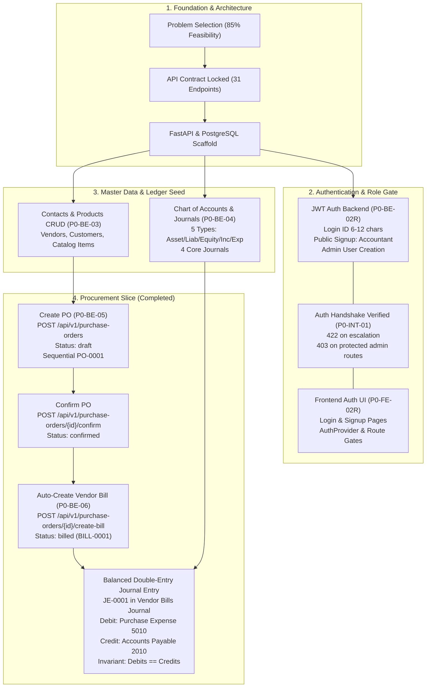
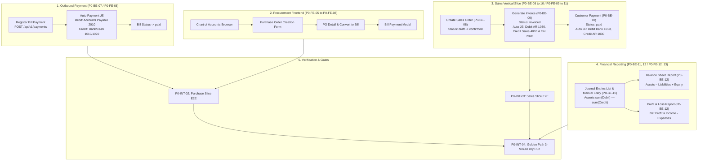

# Urban Furniture Accounting System — Workflow Diagrams

You can preview the workflow diagrams below, or open the interactive visualizer at [`docs/workflow_preview.html`](file:///c:/Users/knlwa/Desktop/GIT/Urban-Furniture-Accounting-System---Outliers/docs/workflow_preview.html) in your browser.

---

## 1. Completed Workflows (What We Have Done)

### Visual Box Flowchart (Always Visible in Any Markdown Preview)

```text
====================================================================================================
                        URBAN FURNITURE ACCOUNTING SYSTEM — COMPLETED WORKFLOW
====================================================================================================

 [ 1. FOUNDATION & ARCHITECTURE ]
 ┌──────────────────────────────────────┐     ┌──────────────────────────────────────┐
 │ Problem Selection & Domain Specs     │ ──> │ REST API Contract & Error Envelope   │
 │ • Urban Furniture (85% Feasibility)  │     │ • 31 REST Endpoints Locked           │
 └──────────────────────────────────────┘     └──────────────────┬───────────────────┘
                                                                 │
                                                                 ▼
                                              ┌──────────────────────────────────────┐
                                              │ FastAPI + PostgreSQL Engine Setup    │
                                              │ • Async DB, Alembic, Healthcheck     │
                                              └──────────────────┬───────────────────┘
                                                                 │
       ┌─────────────────────────────────────────────────────────┴────────────────────────────────────────┐
       ▼                                                                                          ▼
 [ 2. AUTHENTICATION & SECURITY ]                                                   [ 3. MASTER DATA & LEDGER ]
 ┌────────────────────────────────────────────────┐                                 ┌────────────────────────────────────────────────┐
 │ Backend Auth Service (P0-BE-02R)               │                                 │ Chart of Accounts & Journals (P0-BE-04)        │
 │ • Unique Login ID (6-12 chars)                 │                                 │ • 5 Types: Asset, Liability, Equity, Inc, Exp  │
 │ • Argon2 Hash + JWT Token                      │                                 │ • 4 Journals: Invoices, Bills, Bank, Cash      │
 │ • Public Signup: Accountant (invoicing_user)   │                                 │ • Deterministic Seed (seed.py) Verified        │
 │ • Admin-Only User Creation (POST /api/v1/users)│                                 └───────────────────────┬────────────────────────┘
 └───────────────────────┬────────────────────────┘                                                         │
                         │                                                                                  │
                         ▼                                                                                  ▼
 ┌────────────────────────────────────────────────┐                                 ┌────────────────────────────────────────────────┐
 │ Frontend Auth UI & Integration (P0-FE-02R/INT) │                                 │ Contacts & Products Engine (P0-BE-03)          │
 │ • Next.js 16 + shadcn Login & Signup views     │                                 │ • Customers & Vendors (Contacts)               │
 │ • AuthProvider + Role-based route gates        │                                 │ • Goods, Services & Product Pricing            │
 │ • Privilege Escalation Guarded (422 / 403)     │                                 └───────────────────────┬────────────────────────┘
 └────────────────────────────────────────────────┘                                                         │
                                                                                                            │
 ───────────────────────────────────────────────────────────────────────────────────────────────────────────┼──────
                                                                                                            │
 [ 4. PROCUREMENT VERTICAL SLICE (PHASE 1 - COMPLETED) ]                                                    │
                                                                                                            │
   ┌──────────────────────────────────────────────────────────────────────────────────────────────────┐     │
   │ STEP 1: Create Purchase Order (P0-BE-05)                                                         │ <───┘
   │ Endpoint : POST /api/v1/purchase-orders                                                          │
   │ Payload  : { vendor_id: 1, order_lines: [{ product_id: 1, quantity: 10, unit_price: 2500 }] }     │
   │ Action   : Sequential code generated ("PO-0001"), totals computed, status = "draft"              │
   └──────────────────────────────────────────────┬───────────────────────────────────────────────────┘
                                                  │
                                                  ▼
   ┌──────────────────────────────────────────────────────────────────────────────────────────────────┐
   │ STEP 2: Confirm Purchase Order                                                                   │
   │ Endpoint : POST /api/v1/purchase-orders/{id}/confirm                                             │
   │ Action   : Order validated and locked, status = "confirmed"                                      │
   └──────────────────────────────────────────────┬───────────────────────────────────────────────────┘
                                                  │
                                                  ▼
   ┌──────────────────────────────────────────────────────────────────────────────────────────────────┐
   │ STEP 3: Auto-Generate Vendor Bill (P0-BE-06)                                                     │
   │ Endpoint : POST /api/v1/purchase-orders/{id}/create-bill                                         │
   │ Guards   : Validates PO is "confirmed"; Rejects duplicate bills (409 Conflict)                   │
   │ Record   : Vendor Bill created ("BILL-0001"), status = "billed"                                  │
   └──────────────────────────────────────────────┬───────────────────────────────────────────────────┘
                                                  │
                                                  ▼
   ┌──────────────────────────────────────────────────────────────────────────────────────────────────┐
   │ STEP 4: Automated Double-Entry Journal Entry Generation                                          │
   │ Ledger   : Journal Entry "JE-0001" posted to "Vendor Bills Journal"                             │
   │ ──────────────────────────────────────────────────────────────────────────────────────────────── │
   │   DEBIT  : Account 5010 (Purchase Expense)          ───>  Rs. 25,000.00                          │
   │   CREDIT : Account 2010 (Accounts Payable)          ───>  Rs. 25,000.00                          │
   │ ──────────────────────────────────────────────────────────────────────────────────────────────── │
   │ Invariant: Sum of Debits == Sum of Credits (ZERO reconciliation discrepancy)                     │
   └──────────────────────────────────────────────┬───────────────────────────────────────────────────┘
                                                  │
                                                  ▼
   ┌──────────────────────────────────────────────────────────────────────────────────────────────────┐
   │ VERIFICATION: 19 / 19 Automated Backend Tests Passing                                            │
   │ • tests/test_auth.py (3/3)                  • tests/test_contacts.py & test_products.py (6/6)    │
   │ • tests/test_accounts_and_journals.py (5/5) • tests/test_purchase_order.py (2/2)                  │
   │ • tests/test_vendor_bills.py (5/5)           • Full suite green, zero regression                │
   └──────────────────────────────────────────────────────────────────────────────────────────────────┘
```

### Mermaid Diagram (Completed)



---

## 2. Remaining Workflows (What Is Left To Build)

### Visual Box Flowchart (Always Visible in Any Markdown Preview)

```text
====================================================================================================
                        URBAN FURNITURE ACCOUNTING SYSTEM — REMAINING WORKFLOW
====================================================================================================

 [ 1. PROCUREMENT OUTBOUND SETTLEMENT (NEXT UP: P0-BE-07 / P0-FE-08) ]
   ┌──────────────────────────────────────────────────────────────────────────────────────────────────┐
   │ Vendor Bill Payment Settlement                                                                   │
   │ Endpoint : POST /api/v1/payments                                                                 │
   │ Payload  : { vendor_bill_id: 1, journal_id: Bank/Cash, amount: 25000.00, payment_date: "..." }   │
   │ Action   : Updates Vendor Bill status to "paid" (prevents duplicate payment)                     │
   │ ──────────────────────────────────────────────────────────────────────────────────────────────── │
   │ Auto JE  : DEBIT  -> Account 2010 (Accounts Payable)  ───> Rs. 25,000.00                         │
   │            CREDIT -> Account 1010/1020 (Bank / Cash)  ───> Rs. 25,000.00                         │
   └──────────────────────────────────────────────┬───────────────────────────────────────────────────┘
                                                  │
                                                  ▼
 [ 2. PROCUREMENT FRONTEND INTERFACES (P0-FE-05 -> P0-FE-08) ]
   ┌───────────────────────────┐    ┌───────────────────────────┐    ┌──────────────────────────────┐
   │ Hierarchical Chart of     │    │ Purchase Order UI Form    │    │ Bill View & Payment Modal    │
   │ Accounts Browser (FE-05)  │ ─> │ • Live line calculators   │ ─> │ • "Convert to Bill" trigger  │
   │ • Asset/Liab/Equity trees │    │ • Vendor/product selectors│    │ • Bank/Cash payment register │
   └───────────────────────────┘    └───────────────────────────┘    └──────────────┬───────────────┘
                                                                                    │
 ───────────────────────────────────────────────────────────────────────────────────┼────────────────
                                                                                    │
 [ 3. SALES ORDER TO INBOUND PAYMENT VERTICAL SLICE (P0-BE-08 -> 10 / P0-FE-09 -> 11) ]
                                                                                    │
   ┌────────────────────────────────────────────────────────────────────────┐       │
   │ STEP 1: Sales Order Creation & Confirmation                            │ <─────┘
   │ Endpoint : POST /api/v1/sales-orders & POST /sales-orders/{id}/confirm │
   │ Action   : Customer chosen, 18% GST line compute, status: "confirmed"  │
   └───────────────────────────────────┬────────────────────────────────────┘
                                       │
                                       ▼
   ┌────────────────────────────────────────────────────────────────────────┐
   │ STEP 2: One-Click Customer Invoice Generation                          │
   │ Endpoint : POST /api/v1/sales-orders/{id}/create-invoice               │
   │ Action   : Invoice created ("INV-0001"), SO status = "invoiced"        │
   │ ────────────────────────────────────────────────────────────────────── │
   │ Auto JE  : DEBIT  -> Account 1030 (Accounts Receivable) ──> Rs. 29,500 │
   │            CREDIT -> Account 4010 (Sales Income)        ──> Rs. 25,000 │
   │            CREDIT -> Account 2020 (Output GST Payable)  ──> Rs.  4,500 │
   └───────────────────────────────────┬────────────────────────────────────┘
                                       │
                                       ▼
   ┌────────────────────────────────────────────────────────────────────────┐
   │ STEP 3: Inbound Customer Payment Registration                          │
   │ Endpoint : POST /api/v1/payments                                       │
   │ Action   : Invoice marked "paid"                                       │
   │ ────────────────────────────────────────────────────────────────────── │
   │ Auto JE  : DEBIT  -> Account 1010/1020 (Bank / Cash)    ──> Rs. 29,500 │
   │            CREDIT -> Account 1030 (Accounts Receivable) ──> Rs. 29,500 │
   └───────────────────────────────────┬────────────────────────────────────┘
                                       │
 ──────────────────────────────────────┼────────────────────────────────────────────────────────────
                                       │
 [ 4. GENERAL LEDGER AUDIT & FINANCIAL REPORTING (P0-BE-11, P0-BE-12 / P0-FE-12, P0-FE-13) ]
                                       │
   ┌───────────────────────────────────┴────────────────────────────────────┐
   │ Manual Journal Entries & General Ledger Inspection                     │
   │ • POST/GET /api/v1/journal-entries                                     │
   │ • Strict invariant enforcement: sum(Debits) == sum(Credits)            │
   └───────────────────────────────────┬────────────────────────────────────┘
                                       │
             ┌─────────────────────────┴─────────────────────────┐
             ▼                                                   ▼
   ┌───────────────────────────────────┐               ┌───────────────────────────────────┐
   │ Real-Time Balance Sheet Report    │               │ Real-Time Profit & Loss Report    │
   │ Endpoint: GET /reports/balance-sh │               │ Endpoint: GET /reports/profit-loss│
   │ Invariant: Assets = Liab + Equity │               │ Net Profit = Income - Expense     │
   └─────────────────┬─────────────────┘               └─────────────────┬─────────────────┘
                     │                                                   │
 ────────────────────┼───────────────────────────────────────────────────┼──────────────────────────
                     └─────────────────────────┬─────────────────────────┘
                                               │
 [ 5. INTEGRATION GATES & DEMO EXECUTION (P0-INT-02 -> P0-INT-04) ]
                                               │
   ┌───────────────────────────────────────────┴───────────────────────────────────────────┐
   │ P0-INT-02: Purchase Slice E2E (PO -> Bill -> Outbound Pay -> Balanced Ledger)          │
   │ P0-INT-03: Sales Slice E2E (SO -> Invoice -> Inbound Pay -> Balanced Ledger)           │
   │ P0-INT-04: Full Golden Path Dry Run (Deterministic seed + 3-minute flawless demo)     │
   └───────────────────────────────────────────┬───────────────────────────────────────────┘
                                               │
                                               ▼
 [ 6. POST-P0 BACKLOG (P1 & BONUS) ]
   ┌───────────────────────────────────────────────────────────────────────────────────────┐
   │ P1-BE-01 / P1-FE-01: Analytic Accounts & Budgets (Planned vs Actual expense tracking) │
   │ P1-BE-02 / P1-FE-02: Contact Self-Service Portal (Client login to view & pay bills)   │
   │ BONUS-01 / 02 / 03 : Date-period filters, Dashboard KPI summary cards, PDF export     │
   └───────────────────────────────────────────────────────────────────────────────────────┘
```

### Mermaid Diagram (Remaining)


